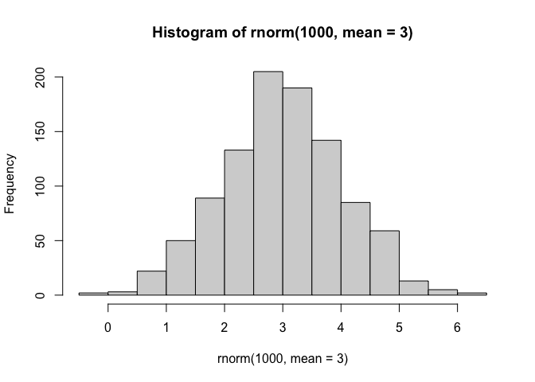

# Lab 7
Gretel Warmuth (PID: A17595945)

Today we are going to learn how to apply different machne learning
methods, beginning with clustering:

The goal is to find groups/clusters in the input data.

First I will make some random data with clear groups with the `rnorm()`
function:

``` r
hist(rnorm(1000, mean=3))
```



Making a histogram with two peaks:

``` r
n <- 30
x <- (c(rnorm(n, -3), rnorm(n, +3)))
hist(x)
```


Making a cluster plot:

``` r
n <- 30
x <- (c(rnorm(n, -3), rnorm(n, +3)))
y <- rev(x)

z<- cbind(x,y)
head(z)
```

                 x         y
    [1,] -1.445700 2.4072826
    [2,] -2.175614 4.3897671
    [3,] -2.234685 1.7870045
    [4,] -2.110598 0.8914104
    [5,] -2.073246 3.0510054
    [6,] -3.604659 1.0209108

``` r
plot(z)
```


Use the `kmeans()` function setting k to 2 and nstart=20

Inspect/print the results

> Q. How many points are in each cluster?

> Q. What ‘component’ of your result object details - cluster size? -
> cluster assignment/membership? - cluster center?

> Q. Plot x colored by the kmeans cluster assignment and add cluster
> centers as blue points

``` r
km <- kmeans(z, centers = 2)
km
```

    K-means clustering with 2 clusters of sizes 30, 30

    Cluster means:
              x         y
    1  2.943558 -2.762417
    2 -2.762417  2.943558

    Clustering vector:
     [1] 2 2 2 2 2 2 2 2 2 2 2 2 2 2 2 2 2 2 2 2 2 2 2 2 2 2 2 2 2 2 1 1 1 1 1 1 1 1
    [39] 1 1 1 1 1 1 1 1 1 1 1 1 1 1 1 1 1 1 1 1 1 1

    Within cluster sum of squares by cluster:
    [1] 68.17928 68.17928
     (between_SS / total_SS =  87.7 %)

    Available components:

    [1] "cluster"      "centers"      "totss"        "withinss"     "tot.withinss"
    [6] "betweenss"    "size"         "iter"         "ifault"      

Results of the object `km`

``` r
attributes(km)
```

    $names
    [1] "cluster"      "centers"      "totss"        "withinss"     "tot.withinss"
    [6] "betweenss"    "size"         "iter"         "ifault"      

    $class
    [1] "kmeans"

Cluster size:

``` r
km$size
```

    [1] 30 30

Cluster assignment/membership:

``` r
km$cluster
```

     [1] 2 2 2 2 2 2 2 2 2 2 2 2 2 2 2 2 2 2 2 2 2 2 2 2 2 2 2 2 2 2 1 1 1 1 1 1 1 1
    [39] 1 1 1 1 1 1 1 1 1 1 1 1 1 1 1 1 1 1 1 1 1 1

Cluster center:

``` r
km$centers
```

              x         y
    1  2.943558 -2.762417
    2 -2.762417  2.943558

Plot:

``` r
plot(z, col="blue")
```


R will recycle the shorter color vector to be the same length as the
longer (number of data points) in z

``` r
plot(z, col=c("red", "blue"))
```


Coloring the clusters:

``` r
plot(z, col=km$cluster)
```


We can use the `points()` function to add new points to an existing plot
like for te cluster centers:

``` r
plot(z, col=km$cluster)
points(km$centers, col="blue", pch=16, cex=1.5)
```


> Q. Run km again and ask for 4 clusters and plot them

``` r
n <- 30
x <- (c(rnorm(n, -3), rnorm(n, +3)))
y <- rev(x)

z<- cbind(x,y)
km4 <- kmeans(z, centers = 4)
plot(z, col = km4$cluster)
points(km4$centers, col="blue", pch=16, cex=1.5)
```


## Hierarchical Clustering

Let’s take our same made-up data `z` and see how hclust works.

First we make a distance matrix of our data to be clustered:

``` r
d <- dist(z)
hc <- hclust(d)
hc
```


    Call:
    hclust(d = d)

    Cluster method   : complete 
    Distance         : euclidean 
    Number of objects: 60 

``` r
plot(hc)
abline(h=8, col="red")
```


I can get my cluster membership vector by “cutting the tree” with the
`cutree()` function:

``` r
grps <- cutree(hc, h=8)
grps
```

     [1] 1 1 1 1 1 1 1 1 1 1 1 1 1 1 1 1 1 1 1 1 1 1 1 1 1 1 1 1 1 1 2 2 2 2 2 2 2 2
    [39] 2 2 2 2 2 2 2 2 2 2 2 2 2 2 2 2 2 2 2 2 2 2

Can you plot `z` colored by our hclust results:

``` r
plot(z, col=grps)
```


## PCA of UK Food Data

Read data from the UK on food consumption in different areas

``` r
url <- "https://tinyurl.com/UK-foods"
x <- read.csv(url, row.names = 1)
head(x)
```

                   England Wales Scotland N.Ireland
    Cheese             105   103      103        66
    Carcass_meat       245   227      242       267
    Other_meat         685   803      750       586
    Fish               147   160      122        93
    Fats_and_oils      193   235      184       209
    Sugars             156   175      147       139

``` r
barplot(as.matrix(x), beside=T, col=rainbow(nrow(x)))
```


``` r
barplot(as.matrix(x), beside=F, col=rainbow(nrow(x)))
```


A so-called pair-wise plot may help to compare countries and categories

``` r
pairs(x, col=rainbow(10), pch=16)
```


It is difficult to see structure and trends in this small dataset- how
can we compare when we have even larger data?! PCA to the rescue!

### PCA

The main function in base R to do PCA is called `prcomp()`

``` r
pca <- prcomp(t(x))
summary(pca)
```

    Importance of components:
                                PC1      PC2      PC3       PC4
    Standard deviation     324.1502 212.7478 73.87622 3.176e-14
    Proportion of Variance   0.6744   0.2905  0.03503 0.000e+00
    Cumulative Proportion    0.6744   0.9650  1.00000 1.000e+00

Let’s look at the `pca` object that we created from running `prcomp()`

``` r
attributes(pca)
```

    $names
    [1] "sdev"     "rotation" "center"   "scale"    "x"       

    $class
    [1] "prcomp"

``` r
pca$x
```

                     PC1         PC2        PC3           PC4
    England   -144.99315   -2.532999 105.768945 -4.894696e-14
    Wales     -240.52915 -224.646925 -56.475555  5.700024e-13
    Scotland   -91.86934  286.081786 -44.415495 -7.460785e-13
    N.Ireland  477.39164  -58.901862  -4.877895  2.321303e-13

The PCA plot:

``` r
plot(pca$x[,1], pca$x[,2], 
     col=c("black", "red", "blue", "darkgreen"), pch=16,
     xlab="PC1 (67.4%)", ylab="PC2 (29%)")
```


Bar plot:

``` r
par(mar=c(10, 3, 0.35, 0))
barplot( pca$rotation[,1], las=2 )
```


